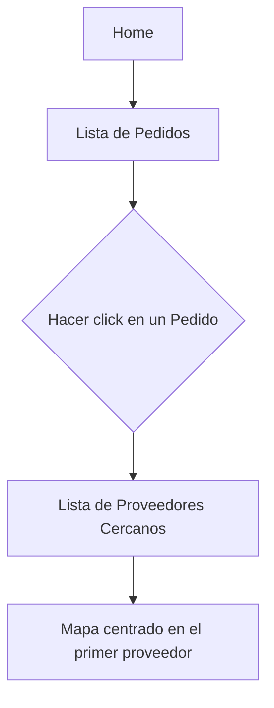

# InstaStore




## Mejoras y compromisos
- ¿Qué mejorarías de tu código? ¿por qué?
> Mejoraria el manejo de proveedores en el mapa con Leaflet. A su vez, trataria de crear un filtro para poder ordenar a los proveedores de acuerdo a `nextDeliveryTime` y `isOpened`. Considero que esto le daría valor agregado a la aplicación actual. Así mismo, añadiría soporte a móviles (hasta el momento solo es responsive en desktop).
- ¿Qué compromisos harías para cumplir con el tiempo? ¿Qué harías la próxima vez para entregar más y sacrificar menos?
> Pensar primero en la logica principal como cargar los pedidos y luego los proveedores.  Así mismo, involucrar los filtros por `nextDeliveryTime` y `isOpened` y asi optimizar la relación entre la orden que llega y los proveedores mas cercanos. 
- ¿Crees que tu aplicación es segura? ¿por qué?
> Si, he utilizado las buenas practicas para codificar de forma segura. Sin embargo, podria integrarse una herramienta como CodeQL (ya sea local o en Github, para verificar cada PR) para revisar posibles errores semanticos y de seguridad.
- ¿Qué harías para medir el comportamiento de tu producto en un entorno de producción?
> Podemos usar pruebas de rendimiento como Google Lighthouse o similares para verificar carga y tiempo de interaccion. De ser necesario, podemos usar Google Analytics para ver como se mueve el usuario en la aplicación. Luego, utilizar CodeQL y Sonar para verificar posibles vulnerabilidades y obtener reportes sobre la mantenibilidad del codigo. 

## Cómo ejecutar

Se utiliza Next.js ya que es recomendado usar un framework con React (ver en [react.dev](https://react.dev/learn/start-a-new-react-project)). Este es un proyecto [Next.js](https://nextjs.org/) iniciado con [`create-next-app`](https://github.com/vercel/next.js/tree/canary/packages/create-next-app).

### Desarrollo
Primero, ejecuta el servidor de desarrollo:

```bash
npm run dev
# o
yarn dev
# o
pnpm dev
# o
bun dev
```

Abre [http://localhost:3000](http://localhost:3000) con tu navegador para ver el resultado.

Puedes comenzar a editar la página modificando `app/page.js`. La página se actualiza automáticamente a medida que editas el archivo.

Este proyecto utiliza [`next/font`](https://nextjs.org/docs/basic-features/font-optimization) para optimizar y cargar automáticamente Red Hat Display, una fuente personalizada de Google.

### Version para publicar
Ejecuta el comando para publicar:

```bash
npm run build
```

Esto producira la carpeta `out`, la cual genera los archivos estáticos. Para correr un servidor local de esta carpeta, utiliza el siguiente comando:

```bash
npx serve out
```

## Despliegue en Vercel

La forma más fácil de desplegar tu aplicación Next.js es utilizando la [Plataforma Vercel](https://vercel.com/new?utm_medium=default-template&filter=next.js&utm_source=create-next-app&utm_campaign=create-next-app-readme) de los creadores de Next.js.

Consulta nuestra [documentación de despliegue de Next.js](https://nextjs.org/docs/deployment) para obtener más detalles.
